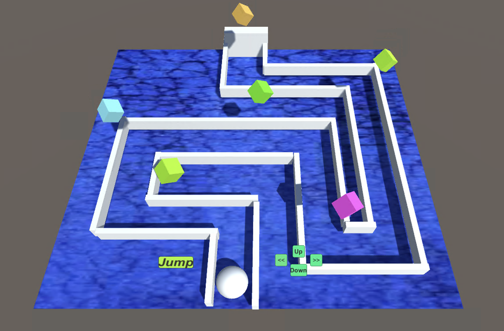

# JumpQuest

Welcome to JumpQuest, a fun and challenging Unity game where you must jump and collect objects levitating. The code can be found inside Scripts folder in Assets directory.

## How to Play

- Click on left, right, up and down buttons to move the ball left, right, forward and backward respectively.
- Click on Jump button to jump and collect objects as you navigate the maze.
- Make sure the ball is inside maze as you navigate. The game doesn't progress if the ball is outside maze.

## How to Open the Game

1. Download the JumpQuest repository as a ZIP file or clone it using Git.
2. Navigate to the "Build" folder within the JumpQuest directory.
3. Run the JumpQuest.exe file.
4. Configure your game settings as desired and start playing!
